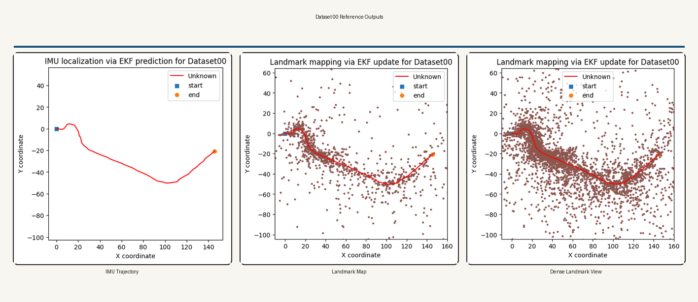
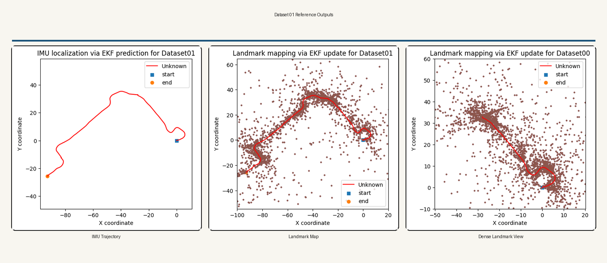

# Visual-Inertial SLAM

This project estimates a moving sensor platform trajectory and a 3D landmark map from calibrated stereo observations and inertial measurements. The pipeline is built around continuous pose propagation on `SE(3)`, stereo landmark initialization, and recursive visual corrections through EKF updates.

The repository also includes two background documents:

- [ECE276A_PR3.pdf](/mntdatalora/src/VisualSLAM/ECE276A_PR3.pdf)
- [ECE276A_Project3.pdf](/mntdatalora/src/VisualSLAM/ECE276A_Project3.pdf)

## Example Outputs

The panels below are built from the PNGs already present in the repository and show the expected style of trajectory and landmark visualizations.




## Problem Formulation

Let the platform pose at time `t` be `T_t in SE(3)`, with rotation `R_t in SO(3)` and translation `p_t in R^3`. Let `m_j in R^3` denote the `j`th landmark in the world frame. The inputs are:

- body-frame linear velocity `v_t`
- body-frame angular velocity `w_t`
- calibrated stereo observations of image features

The motion model is written in the Lie group form

```math
T_{t+1} = T_t \exp(\Delta t \, \hat{\xi}_t), \qquad
\xi_t = \begin{bmatrix} v_t \\ w_t \end{bmatrix}
```

where `hat(.)` maps a twist vector to the corresponding element of `se(3)`.

For a landmark `m_j`, the stereo measurement model is a projection of the landmark into the left and right cameras:

```math
z_{t,j} = \pi\!\left(T_{\text{cam}\leftarrow \text{imu}} \, T_t^{-1} \, m_j\right) + n_{t,j}
```

with `pi(.)` the perspective projection and `n_{t,j}` the image measurement noise. The full estimation problem is therefore a nonlinear state-estimation problem over rigid-body motion and static scene structure.

## Estimation Strategy

The pipeline is split into four stages.

`Part 1`
Propagate pose from inertial measurements only.

`Part 2`
Generate stereo feature tracks from images when tracks are not already supplied.

`Part 3`
Estimate the landmark map while treating the inertial trajectory as fixed.

`Part 4`
Perform visual-inertial SLAM by alternating inertial prediction and visual correction.

This separation is useful because it exposes the behavior of each component independently before combining them into the full estimator.

## Installation

From the project root:

```bash
cd /mntdatalora/src/VisualSLAM
pip install -r requirements.txt
```

Required packages:

- `numpy`
- `scipy`
- `matplotlib`
- `pandas`
- `opencv-python`
- `tabulate`

Optional:

- `cupy` for the `--use-gpu` path

## Data Layout

Place data in the following structure:

```text
data/
  dataset00/
    dataset00.npy
    dataset00_imgs.npy
  dataset01/
    dataset01.npy
    dataset01_imgs.npy
  dataset02/
    dataset02.npy
    dataset02_imgs.npy
```

Expected keys inside `datasetXX.npy`:

- `v_t`
- `w_t`
- `timestamps`
- `K_l`
- `K_r`
- `extL_T_imu`
- `extR_T_imu`
- `features` if tracked features are already available

Accepted data layouts:

- `v_t`, `w_t`: `(T, 3)` or `(3, T)`
- `features`: logically `(4, M, T)`; several common permutations are normalized by the loader
- `datasetXX_imgs.npy`: dict with left/right images or stereo stacks such as `(T, 2, H, W)` or `(2, T, H, W)`

More detail is in [data/README.md](/mntdatalora/src/VisualSLAM/data/README.md).

## Recommended Run Order

For `dataset00` and `dataset01`:

1. Run Part 1
2. Run Part 3
3. Run Part 4
4. Run evaluation

For `dataset02`:

1. Run Part 2 if tracked features are not present in `dataset02.npy`
2. Run Part 3
3. Run Part 4
4. Run evaluation

## Part 1: IMU Pose Propagation

### Theory

The inertial stage treats the measured linear and angular velocities as a body-frame twist and integrates the pose directly on `SE(3)`. This avoids breaking rigid motion into inconsistent Euclidean updates and keeps the pose evolution geometrically correct.

The covariance is propagated with a first-order linearization:

```math
\Sigma_{t+1} = F_t \Sigma_t F_t^\top + Q_t
```

where `F_t` is the transition Jacobian induced by the adjoint action of the current motion increment, and `Q_t` is the process noise derived from IMU uncertainty. This stage gives the baseline trajectory and also provides the motion prior used later by the visual updates.

### Run

```bash
python scripts/run_part1_imu_localization.py \
  --datasets 00 01 \
  --data-dir data \
  --output-root results
```

### Outputs

- `results/dataset_00/part1_imu_prediction.npz`
- `results/dataset_00/part1_imu_trajectory.png`
- `results/dataset_00/metrics_part1.json`
- `results/dataset_01/part1_imu_prediction.npz`
- `results/dataset_01/part1_imu_trajectory.png`
- `results/dataset_01/metrics_part1.json`

## Part 2: Stereo Feature Tracking

### Theory

Visual updates require consistent feature correspondences across the stereo pair and across time. This stage detects strong image points in the left image, associates them with the right image to recover disparity, and then tracks them temporally to build a measurement tensor.

The current implementation uses Shi-Tomasi corner detection and Lucas-Kanade optical flow. Conceptually, the tracker is building a sequence

```math
z_t = [u_l, v_l, u_r, v_r]^\top
```

for each feature and each time step. Valid stereo disparity provides depth observability, while temporal consistency allows the same scene point to contribute information over multiple frames.

### Run

Use this stage when image tracks need to be generated explicitly.

```bash
python scripts/run_part2_feature_tracking.py \
  --datasets 02 \
  --data-dir data \
  --output-root results \
  --max-corners 1500 \
  --quality-level 0.01 \
  --min-distance 7
```

### Outputs

- `results/dataset_02/part2_feature_tracks.npz`
- `results/dataset_02/metrics_part2.json`

## Part 3: Landmark Mapping

### Theory

In the mapping stage, the pose trajectory is treated as known and the uncertainty is pushed into the landmark states. A stereo pair gives a direct initialization through disparity:

```math
d = u_l - u_r, \qquad
z = \frac{f_x b}{d}
```

with `b` the stereo baseline. Once depth is recovered, the back-projected feature is transformed into the world frame to initialize a landmark estimate.

Each observed landmark is then refined through EKF measurement updates. Since the landmarks are static, there is no landmark motion prediction term; only measurement corrections are applied when a landmark is re-observed. In practical terms, this stage converts sparse stereo correspondences into a globally expressed map consistent with the inertial trajectory.

### Run

```bash
python scripts/run_part3_landmark_mapping.py \
  --datasets 00 01 \
  --data-dir data \
  --output-root results \
  --feature-stride 4 \
  --landmark-gate-px 50
```

If explicit tracks from Part 2 should be used:

```bash
python scripts/run_part3_landmark_mapping.py \
  --datasets 02 \
  --data-dir data \
  --output-root results \
  --track-file results/dataset_02/part2_feature_tracks.npz
```

### Outputs

- `results/dataset_00/part3_landmark_mapping.npz`
- `results/dataset_00/part3_landmarks_xy.png`
- `results/dataset_00/metrics_part3.json`
- `results/dataset_01/part3_landmark_mapping.npz`
- `results/dataset_01/part3_landmarks_xy.png`
- `results/dataset_01/metrics_part3.json`

## Part 4: Visual-Inertial SLAM

### Theory

The full SLAM stage combines the inertial motion prior with reprojection-based visual corrections. At each step, the filter first predicts the next pose from the IMU, then uses visible landmarks to compute a reprojection residual in image space. That residual is mapped back to a pose correction through a linearized measurement model.

This produces the standard predict-update structure:

```math
\text{predict: } (T_t, \Sigma_t) \rightarrow (T_{t+1}^-, \Sigma_{t+1}^-)
```

```math
\text{update: } r = z - h(T_{t+1}^-, m), \qquad
K = \Sigma^- H^\top (H \Sigma^- H^\top + R)^{-1}
```

The corrected pose is then used to refine the landmark states again. In effect, the inertial stream provides short-horizon motion continuity, while the visual stream suppresses drift by anchoring the estimate to repeated scene structure.

### Run

```bash
python scripts/run_part4_vi_slam.py \
  --datasets 00 01 \
  --data-dir data \
  --output-root results \
  --feature-stride 4 \
  --max-pose-features 40 \
  --min-pose-features 6 \
  --pose-gate-px 60
```

### Outputs

- `results/dataset_00/part4_vi_slam.npz`
- `results/dataset_00/part4_trajectory_comparison.png`
- `results/dataset_00/part4_landmarks_xy.png`
- `results/dataset_00/metrics_part4.json`
- `results/dataset_01/part4_vi_slam.npz`
- `results/dataset_01/part4_trajectory_comparison.png`
- `results/dataset_01/part4_landmarks_xy.png`
- `results/dataset_01/metrics_part4.json`

## Run The Full Pipeline

```bash
python scripts/run_all.py \
  --datasets 00 01 \
  --data-dir data \
  --output-root results \
  --max-part 4 \
  --run-part2-if-missing
```

## Evaluation

Build aggregate metrics:

```bash
python eval/compute_metrics.py \
  --results-root results \
  --datasets 00 01 \
  --output-dir eval
```

Generate report-ready plots and markdown tables:

```bash
python eval/build_report_assets.py \
  --metrics-csv eval/metrics_summary.csv \
  --output-dir eval \
  --output-md eval/report_assets.md
```

Generated evaluation artifacts:

- `eval/metrics_summary.csv`
- `eval/metrics_summary.md`
- `eval/plot_part1_path_length.png`
- `eval/plot_part3_landmarks_initialized.png`
- `eval/plot_part4_endpoint_improvement.png`
- `eval/plot_part4_pose_residual.png`
- `eval/report_assets.md`

More detail is in [eval/README.md](/mntdatalora/src/VisualSLAM/eval/README.md).

## Notes

- New runs write outputs under `results/`.
- The example panels at the top are composed from the PNGs already stored in the repository.
- `--use-gpu` is optional and currently accelerates only part of the VI-SLAM linear algebra path when CuPy is available.
- If a dataset already provides tracked features, Part 2 is not required.
