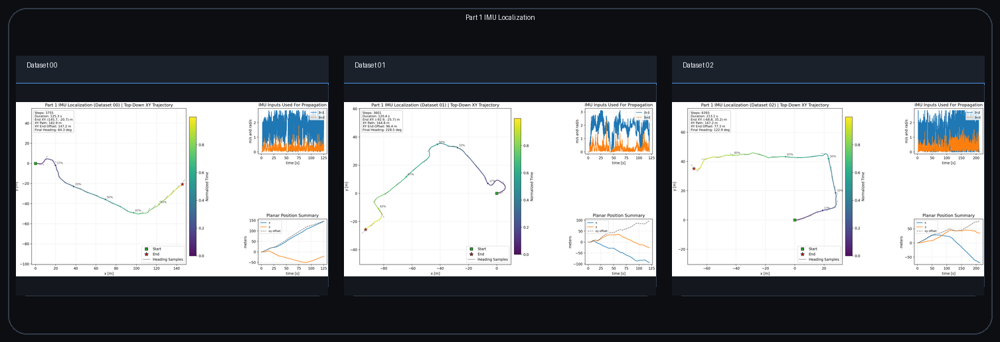
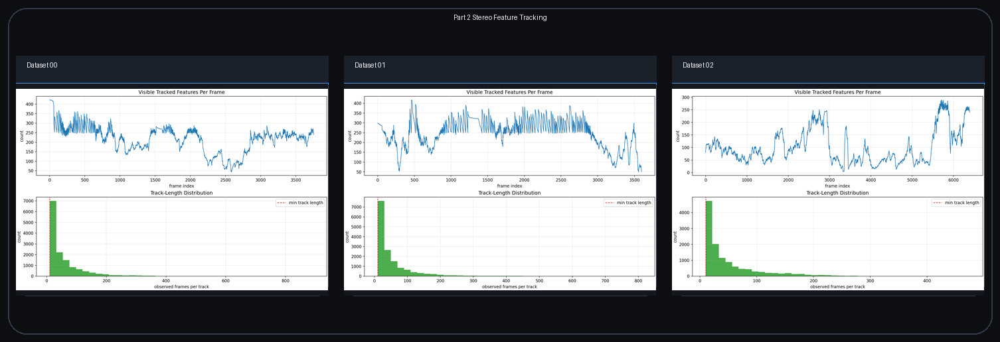
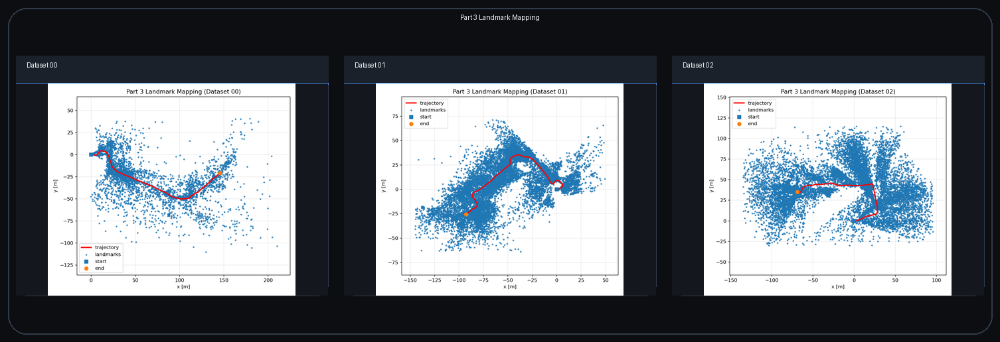
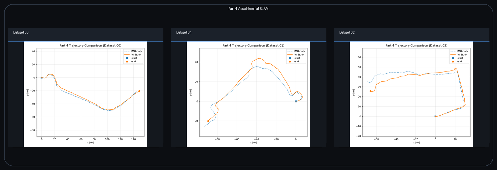

# Visual-Inertial SLAM

## Abstract

This project solves a calibrated stereo visual-inertial SLAM problem from body-frame linear velocity, body-frame angular velocity, stereo camera observations, and camera-to-IMU extrinsic calibration. The pipeline estimates a pose trajectory on `SE(3)`, reconstructs a persistent landmark map in the world frame, and then uses repeated stereo reprojection constraints to reduce the drift of the inertial prediction.

The repository is organized around the four stages required by the project brief:

1. IMU-only pose propagation
2. Stereo feature tracking
3. Landmark-only EKF mapping with fixed poses
4. Visual-inertial SLAM with alternating prediction and correction

The refined outputs referenced in this README are stored under [`results_refined/`](results_refined). For presentation quality, the top-level gallery uses large combined panel assets generated from the per-dataset outputs by [`scripts/build_readme_panels.py`](scripts/build_readme_panels.py).

## Output Gallery

### Part 1 IMU Trajectory Evolution


IMU-only localization shows how pure dead reckoning behaves before any visual correction is applied. The trajectories are integrated directly on `SE(3)` and are intentionally left unconstrained so the effect of the inertial model is visible.

### Part 2 Stereo Feature Tracking Evolution


The tracking stage shows stereo correspondences and temporal motion together with the evolving robot path and track statistics. These regenerated tracks are especially important for `dataset01` and `dataset02`, where they outperform the bundled feature tensors in temporal coverage.

### Part 3 Landmark Map Evolution


Landmark mapping fixes the IMU trajectory and pushes the uncertainty into the map. The result is an evolving stereo-informed landmark cloud aligned to the inertial path.

### Part 4 Visual-Inertial SLAM Evolution


The final SLAM stage combines the IMU prior with stereo reprojection corrections. The panel shows how the corrected trajectory diverges from or improves on the IMU-only path depending on the visual evidence available in each dataset.

## Setup

From the project root:

```bash
cd /mntdata/src/Visual-Inertial-SLAM
pip install -r requirements.txt
```

Core dependencies:

- `numpy`
- `scipy`
- `matplotlib`
- `opencv-python-headless`
- `pandas`
- `tabulate`
- `Pillow`

Optional:

- `cupy` for the CUDA-backed linear algebra path where supported

## References

- [ECE276A_PR3.pdf](ECE276A_PR3.pdf): assignment specification
- [ECE276A_Project3.pdf](ECE276A_Project3.pdf): alternate project writeup used as a secondary reference

## Data Layout

Expected directory structure:

```text
data/
  dataset00/
    dataset00.npy
    dataset00_imgs.npy or stereo video files
  dataset01/
    dataset01.npy
    dataset01_imgs.npy or stereo video files
  dataset02/
    dataset02.npy
    dataset02_imgs.npy or stereo video files
```

Expected keys inside `datasetXX.npy`:

- `v_t`
- `w_t`
- `timestamps`
- `K_l`
- `K_r`
- `extL_T_imu`
- `extR_T_imu`
- `features` when a bundled stereo feature tensor is provided

The loader normalizes several common array layouts for velocities, timestamps, stereo images, and feature tensors, so the scripts can work across the provided datasets without manual reshaping.

## Execution Order

Typical full run:

```bash
python scripts/run_part1_imu_localization.py --data-dir data --output-root results_refined --datasets 00 01 02
python scripts/run_part2_feature_tracking.py --data-dir data --output-root results_refined --datasets 00 01 02
python scripts/run_part3_landmark_mapping.py --data-dir data --output-root results_refined --datasets 00 01 02
python scripts/run_part4_vi_slam.py --data-dir data --output-root results_refined --datasets 00 01 02
```

Dataset-specific choices used in the refined runs:

| Dataset | Part 2 source | Part 3 source | Part 4 source | Reason |
| --- | --- | --- | --- | --- |
| `00` | tracked from videos | bundled `features` | bundled `features` | the provided tracks are already dense and stable for mapping and SLAM |
| `01` | tracked from videos | Part 2 tracks | Part 2 tracks | regenerated tracks have much stronger temporal coverage |
| `02` | tracked from videos | Part 2 tracks | Part 2 tracks | regenerated tracks plus time-aware selection improve SLAM stability |

## Part 1: IMU Localization

### Model

Let `T_k in SE(3)` be the IMU pose at time step `k`. The measured body-frame twist is formed from linear and angular velocity:

```math
\xi_k =
\begin{bmatrix}
v_k \\
\omega_k
\end{bmatrix},
\qquad
\hat{\xi}_k \in \mathfrak{se}(3).
```

The pose is propagated on the Lie group:

```math
T_{k+1} = T_k \exp(\Delta t_k \, \hat{\xi}_k).
```

This formulation keeps the state on `SE(3)` and avoids mixing Euclidean translation updates with inconsistent rotation updates. The covariance is propagated with a first-order linearization:

```math
\Sigma_{k+1} = F_k \Sigma_k F_k^\top + Q_k,
```

where `F_k` is the motion Jacobian induced by the increment and `Q_k` is the IMU process noise. In the refined outputs we do not manually clamp the motion to a ground plane, because the project’s Part 1 is an IMU-only propagation problem rather than a constrained planar estimator.

### Interpretation

Part 1 is the baseline against which all later visual corrections are judged. It captures the short-horizon motion trend well, but it also accumulates drift because there is no visual information forcing the estimate back toward repeated scene structure.

### Static Panel



### Current Metrics

| Dataset | Steps | Mean `dt` [s] | XY path [m] | XY endpoint [m] | 3D endpoint [m] |
| --- | ---: | ---: | ---: | ---: | ---: |
| `00` | 3755 | 0.0334 | 182.93 | 147.18 | 163.70 |
| `01` | 3601 | 0.0335 | 164.79 | 96.35 | 133.65 |
| `02` | 6393 | 0.0333 | 167.21 | 77.28 | 182.83 |

### Main Outputs

- `part1_imu_prediction.npz`
- `part1_imu_trajectory.gif`
- `part1_imu_trajectory.png`
- `metrics_part1.json`

## Part 2: Stereo Feature Tracking

### Model

For each retained track `j`, the stereo measurement at time `k` is

```math
z_{k,j} =
\begin{bmatrix}
u_{k,j}^{l} \\
v_{k,j}^{l} \\
u_{k,j}^{r} \\
v_{k,j}^{r}
\end{bmatrix}.
```

The tracker uses Shi-Tomasi detection in the left image, Lucas-Kanade optical flow over time, and left-right association across the stereo pair. The core geometric cue is disparity:

```math
d_{k,j} = u_{k,j}^{l} - u_{k,j}^{r},
\qquad
z_{k,j}^{\text{depth}} = \frac{f_x b}{d_{k,j}},
```

where `b` is the stereo baseline. Positive, stable disparity gives metric depth observability, while temporal consistency keeps the same scene point alive over many frames. The implementation also filters tracks using forward-backward checks, stereo consistency checks, and track-length constraints.

### Interpretation

Part 2 is not only a preprocessing stage. It changes the quality of the downstream estimator. In `dataset01` and `dataset02`, the regenerated tracks are denser and more persistent than the bundled feature tensors, which materially improves both landmark mapping and SLAM.

### Static Panel



### Current Metrics

| Dataset | Track source | Tracks | Median track length [frames] | Median visible / frame | Max visible / frame | Reference median visible / frame |
| --- | --- | ---: | ---: | ---: | ---: | ---: |
| `00` | `videos` | 13949 | 32 | 230 | 422 | 73 |
| `01` | `videos` | 15295 | 30 | 260 | 417 | 100 |
| `02` | `videos` | 12421 | 29 | 82 | 289 | 88 |

### Main Outputs

- `part2_feature_tracks.npz`
- `part2_feature_tracking.gif`
- `part2_feature_tracking_montage.png`
- `part2_feature_stats.png`
- `part2_feature_comparison.png`
- `metrics_part2.json`

## Part 3: Landmark Mapping

### Model

Part 3 fixes the IMU trajectory and estimates only the landmark states. Stereo disparity initializes depth:

```math
d = u^l - u^r,
\qquad
z = \frac{f_x b}{d}.
```

Given the left image coordinates, the landmark is back-projected into the camera frame:

```math
m^{c} =
z
\begin{bmatrix}
(u^l - c_x)/f_x \\
(v^l - c_y)/f_y \\
1
\end{bmatrix}.
```

The current camera pose and camera-to-IMU extrinsics then transform this point into the world frame. Once initialized, a landmark receives EKF corrections whenever it is re-observed:

```math
r = z - h(m),
\qquad
K = P H^\top (H P H^\top + R)^{-1},
\qquad
m^+ = m + K r.
```

Because the pose is treated as fixed, the computational burden stays in the landmark updates rather than in a full joint state. This makes Part 3 a clean diagnostic stage for checking triangulation, reprojection, initialization quality, and landmark gating without the confounding effect of pose correction.

### Interpretation

The goal of Part 3 is not to close loops or remove inertial drift. It is to test whether the stereo geometry and the map update logic are internally consistent when the pose is assumed known. This is why Part 3 is the right place to compare bundled feature tensors against the Part 2 tracks.

### Static Panel



### Current Metrics

| Dataset | Feature source | Initialized landmarks | Total landmarks | Mean reprojection error [px] |
| --- | --- | ---: | ---: | ---: |
| `00` | `dataset_features` | 5206 | 5376 | 6.56 |
| `01` | `part2_tracks` | 15295 | 15295 | 6.10 |
| `02` | `part2_tracks` | 12421 | 12421 | 5.42 |

### Main Outputs

- `part3_landmark_mapping.npz`
- `part3_landmark_mapping.gif`
- `part3_landmark_mapping_montage.png`
- `part3_landmarks_xy.png`
- `part3_landmark_stats.png`
- `metrics_part3.json`

## Part 4: Visual-Inertial SLAM

### Model

Part 4 combines the inertial motion prior with reprojection-based visual corrections. The predicted pose is

```math
T_{k+1}^{-} = T_k^{+} \exp(\Delta t_k \, \hat{\xi}_k).
```

Visible landmarks generate a stacked stereo residual

```math
r = z - h(T^{-}, m),
```

and the linearized EKF update produces a pose increment

```math
K = \Sigma^{-} H^\top (H \Sigma^{-} H^\top + R)^{-1},
\qquad
\delta \xi = K r,
\qquad
T^{+} = \exp(\widehat{\delta \xi}) T^{-}.
```

The implementation uses the left-perturbation form of the pose update, which is the correct `SE(3)` update model for the current Jacobian convention. In practice, the solver is stabilized by alternating two operations:

1. build or refine landmarks from the current pose estimate
2. correct the pose trajectory using reprojection residuals against those landmarks

This is not a fully dense smoothing backend. It is a recursive SLAM pipeline designed to stay numerically stable on the provided datasets while still enforcing meaningful visual corrections.

### Interpretation

The most important design choice in the refined runs is the feature source. `dataset00` works best with the bundled features. `dataset01` and `dataset02` work better with the Part 2 track files. `dataset02` also needs time-aware landmark selection so the chosen tracks remain visible across the whole sequence instead of clustering in a small portion of time.

There is no external ground-truth trajectory in the provided project data, so Part 4 is evaluated relative to the IMU-only baseline and by its reprojection residuals, not by absolute pose error against a reference trajectory.

### Static Panel



### Current Metrics

| Dataset | Feature source | Selected / total features | Initialized landmarks | Mean pose residual [px] | Mean landmark residual [px] | Endpoint distance IMU `->` VI-SLAM [m] |
| --- | --- | ---: | ---: | ---: | ---: | --- |
| `00` | `dataset_features` | `1715 / 5376` | 1676 | 4.49 | 5.16 | `163.70 -> 163.33` |
| `01` | `part2_tracks` | `3824 / 15295` | 3824 | 4.86 | 4.69 | `133.61 -> 129.65` |
| `02` | `part2_tracks` | `1491 / 12421` | 1491 | 3.93 | 3.65 | `182.83 -> 176.08` |

### Main Outputs

- `part4_vi_slam.npz`
- `part4_vi_slam.gif`
- `part4_vi_slam_montage.png`
- `part4_trajectory_comparison.png`
- `part4_landmarks_xy.png`
- `metrics_part4.json`

## Evaluation

Aggregate evaluation scripts remain under [`eval/`](eval). Typical usage:

```bash
python eval/compute_metrics.py --results-root results_refined --datasets 00 01 02 --output-dir eval
python eval/build_report_assets.py --metrics-csv eval/metrics_summary.csv --output-dir eval --output-md eval/report_assets.md
```


## License

This project is distributed under the license terms provided in [LICENSE](LICENSE).
